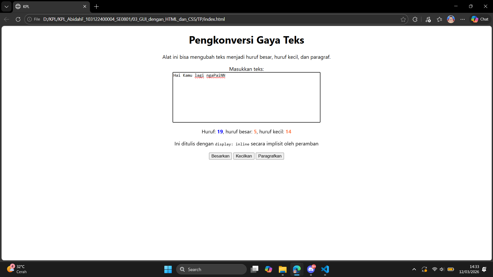

# Tugas Mandiri 03: GUI DENGAN HTML DAN CSS

Nama : Abidah F

Kelas : SE08-01

NIM : 103122400004

**Soal**

Cari 1 fitur yang belum include di code sebelumnya

**Kode sumber**

Tersedia di [index.js](../TP/index.css), [index.html](../TP/index.html) dan [index.css](../TP/index.css) 

**Output**

**Deskripsi Program**

Pada pengembangan sebelumnya, aplikasi hanya mampu menghitung jumlah huruf secara keseluruhan dan jumlah huruf besar pada teks yang dimasukkan pengguna. Pada pembaruan ini ditambahkan fitur baru untuk menghitung jumlah huruf kecil secara otomatis.

Fitur ini bekerja dengan mendeteksi setiap karakter yang dimasukkan pengguna melalui textarea, kemudian memeriksa apakah karakter tersebut termasuk huruf kecil menggunakan pola pencocokan karakter. Hasil perhitungan huruf kecil kemudian ditampilkan secara langsung pada antarmuka bersama dengan jumlah huruf keseluruhan dan huruf besar.

Dengan penambahan fitur ini, aplikasi menjadi lebih informatif karena pengguna dapat mengetahui distribusi penggunaan huruf besar dan huruf kecil dalam teks yang mereka tulis. Hal ini juga meningkatkan fungsionalitas aplikasi dalam menganalisis struktur teks secara lebih lengkap.