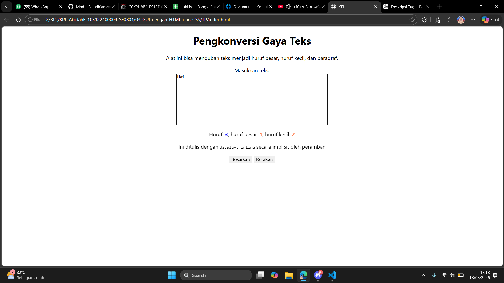
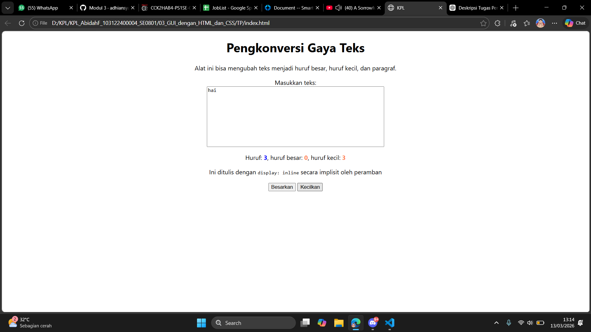

# Tugas Pendahuluan 03: GUI DENGAN HTML DAN CSS

Nama : Abidah F

Kelas : SE08-01

NIM : 103122400004

**Soal**

Setelah kamu menyelesaikan tugas pendahuluan (bisa buka di atas), terapkanlah fungsi untuk (1) menghitung huruf kecil yang disediakan di #hk, (2) mengubah huruf kecil ke huruf besar ketika pengguna menekan tombol #huruf-besar, dan (3) mengubah huruf besar ke huruf kecil ketika pengguna menekan tombol #huruf-kecil. Kemudian, hapuslah fitur "Paragrafkan" dari alat.

**Kode sumber**

Tersedia di [index.js](../TP/index.js), [index.html](../TP/index.html) dan [index.css](../TP/index.css) 

**Output**

fitur hitung huruf kecil

fitur kapital

fitur huruf kecil

**Deskripsi Program**

Fitur pertama yang ditambahkan adalah fungsi untuk menghitung jumlah huruf kecil pada teks yang dimasukkan pengguna. Sistem akan membaca seluruh teks pada area input, kemudian menampilkan jumlah huruf kecil melalui elemen dengan id hk.

Fitur kedua adalah fungsi untuk mengubah seluruh huruf kecil menjadi huruf besar. Ketika pengguna menekan tombol huruf-besar, sistem akan memproses teks pada area input dan mengonversi setiap huruf kecil menjadi huruf kapital secara otomatis.

Fitur ketiga adalah fungsi untuk mengubah huruf besar menjadi huruf kecil. Saat tombol huruf-kecil ditekan, sistem akan memproses teks yang ada dan mengubah seluruh huruf kapital menjadi huruf kecil.

Selain penambahan fitur tersebut, dilakukan juga penyederhanaan pada alat dengan menghapus fitur Paragrafkan yang sebelumnya tersedia. Penghapusan ini dilakukan agar alat lebih fokus pada fungsi pengolahan huruf.