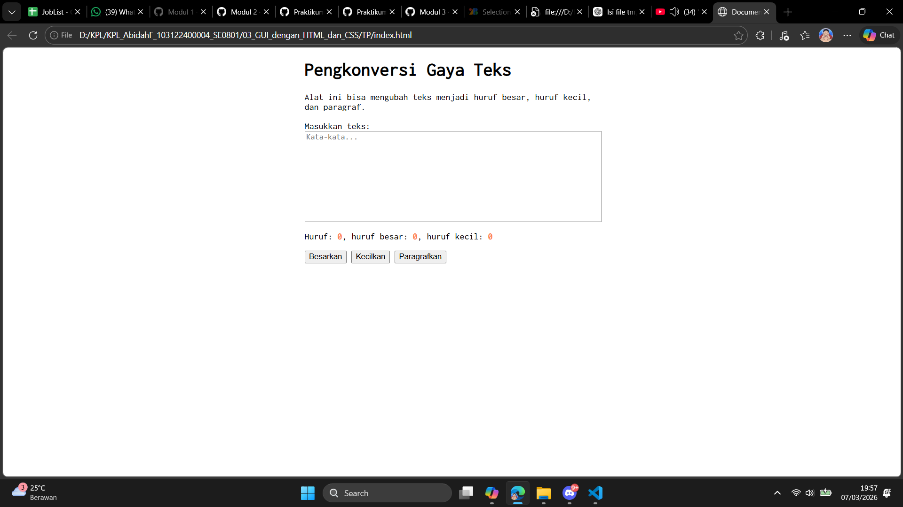

# Tugas Pendahuluan 03: GUI DENGAN HTML DAN CSS
**Soal**

Buatlah tata letak laman yang kamu buat berada di tengah seperti di bawah ini, dan juga ubah font-nya dengan Inconsolata dari Google Fonts.

**Kode sumber**

Tersedia di [index.js](./index.js), [index.html](./index.html) dan [index.css](./index.css) 

**Output**

**Deskripsi Program**

membuat gui dengan html dan css