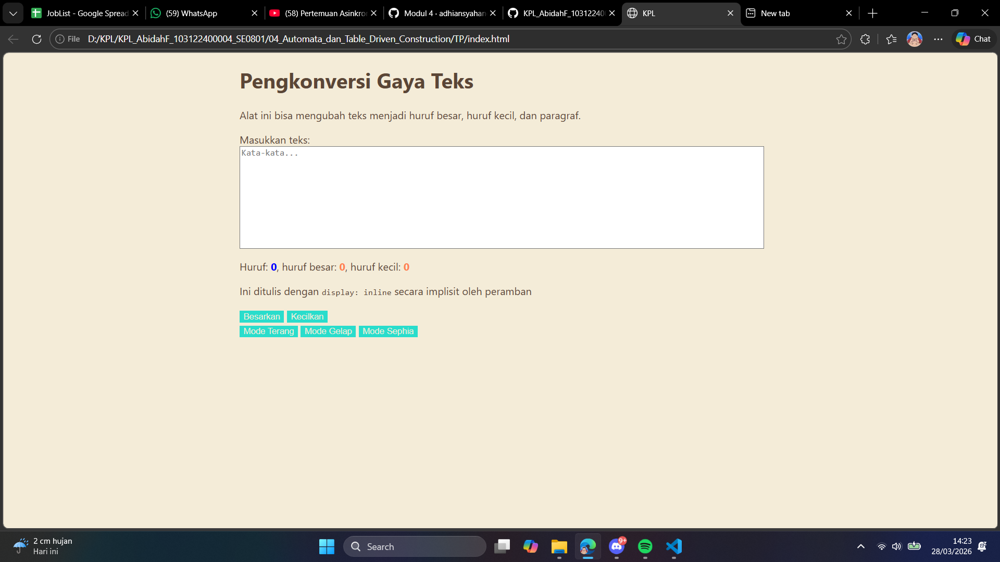

# Tugas Pendahuluan 04: Automata dan Table Driven Construction

Nama : Abidah F

Kelas : SE08-01

NIM : 103122400004

**Soal**

Membuat Mode Sophia

**Kode sumber**

Tersedia di [index.js](../TP/index.css), [index.html](../TP/index.html) dan [index.css](../TP/index.css) 

**Output**

**Deskripsi Program**

- Tambah mode sepia pada ModeState dengan class `sephia-mode`
- Perbaiki method apply() agar selalu remove semua mode class sebelum menambah yang baru, mencegah mode bertumpuk
- Hubungkan tombol-sephia ke event listener
- Perbaiki layout dengan wrapper .container (max-width: 600px, margin: auto)
- Ganti margin: auto pada textarea ke width: 100% agar mengikuti container
- Perbaiki @media query yang tidak tertutup dengan benar