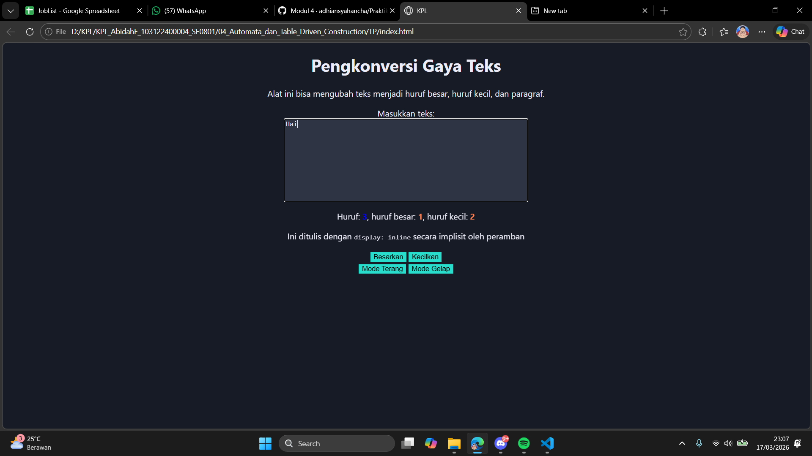

# Tugas Pendahuluan 04: Automata dan Table Driven Construction

Nama : Abidah F

Kelas : SE08-01

NIM : 103122400004

**Soal**

Buka untuk melihat
Tambahkan mode gelap sekaligus untuk editor-kecil dan tombol-tombolnya. Ketentuan warna untuk latar belakang editor-kecil adalah #2e3443, sementara untuk tombol adalah #29ddcc. Teks untuk tombol tetap mengikuti warna teks sebelumnya.
Untuk menghapus pinggiran tombol, nyatakan properti border untuk tidak ditunjukkan.

**Kode sumber**

Tersedia di [index.js](./index.js), [index.html](./index.html) dan [index.css](./index.css) 

**Output**

**Deskripsi Program**

membuat gui dengan html dan css