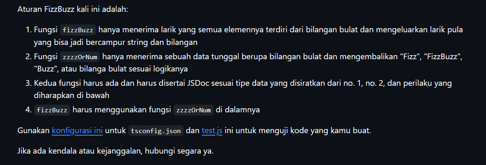
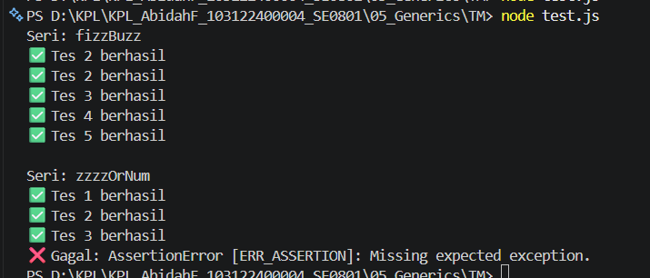

# Tugas Pendahuluan 05: Generics

Nama : Abidah F

Kelas : SE08-01

NIM : 103122400004

**Soal**

**Kode sumber**

Tersedia di [index.js](./index.js)

**Output**

**Deskripsi Program**

Program ini merupakan implementasi algoritma FizzBuzz menggunakan bahasa pemrograman JavaScript dengan pendekatan modular. Terdapat dua fungsi utama, yaitu zzzzOrNum dan fizzBuzz. Fungsi zzzzOrNum bertugas untuk memproses satu buah bilangan bulat dan mengembalikannya dalam bentuk string "Fizz" jika habis dibagi 3, "Buzz" jika habis dibagi 5, serta "FizzBuzz" jika habis dibagi keduanya. Apabila bilangan tidak memenuhi kondisi tersebut, maka fungsi akan mengembalikan nilai bilangan itu sendiri. Selain itu, fungsi ini juga dilengkapi dengan validasi input untuk memastikan bahwa data yang diproses bertipe number, sehingga akan menghasilkan error apabila menerima input yang tidak sesuai.

Sementara itu, fungsi fizzBuzz digunakan untuk memproses sekumpulan bilangan dalam bentuk array. Fungsi ini memanfaatkan metode map() untuk mengiterasi setiap elemen dalam array dan memanggil fungsi zzzzOrNum pada setiap elemen tersebut. Hasilnya adalah sebuah array baru yang berisi kombinasi antara angka dan string sesuai dengan aturan FizzBuzz. Program ini juga menggunakan JSDoc untuk mendokumentasikan tipe parameter dan nilai kembalian dari setiap fungsi, sehingga dapat membantu dalam proses pengecekan tipe data menggunakan TypeScript serta meningkatkan keterbacaan kode.
