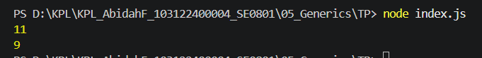

# Tugas Pendahuluan 05: Generics

Nama : Abidah F

Kelas : SE08-01

NIM : 103122400004

**Soal**

Bagaimana caramu hanya dengan satu fungsi generik bisa mengurus keduanya?

**Kode sumber**

Tersedia di [index.js](./index.js)

**Output**

**Deskripsi Program**

membuat function di js