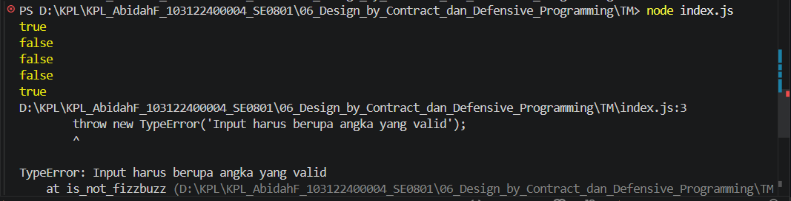

# Tugas Mandiri 06 : Design_by_Contract_dan_Defensive_Programming

Nama : Abidah F

Kelas : SE08-01

NIM : 103122400004

**Soal**

Lindungi kode ini dari bilangan-bilangan "fizz buzz"! Tugasmu adalah membuat fungsi yang menolak bilangan-bilangan kelipatan 3, 5, atau 15, menerima bilangan-bilangan bukan "fizz buzz", dan melempar yang bukan bilangan bulat.

**Kode sumber**

Tersedia di [index.js](./index.js)

**Output**

**Penjelasan Code**

membuat fungsi yang menolak bilangan-bilangan kelipatan 3, 5, atau 15, menerima bilangan-bilangan bukan "fizz buzz", dan melempar yang bukan bilangan bulat.