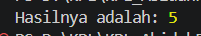

# Tugas Pendahuluan 06 : Design_by_Contract_dan_Defensive_Programming

Nama : Abidah F

Kelas : SE08-01

NIM : 103122400004

**Soal**

Menurutmu, kapankah kita saatnya menggunakan asersi atau eksepsi untuk fungsi seperti ini di atas? Apakah kita harus sepenuhnya asersi, atau sepenuhnya eksepsi? Lakukan riset dan berikan jawabannya dalam bentuk esai minimal 300 kata.

**Kode sumber**

Tersedia di [asersi.js](./asersi.js) & [eksepsi.js](./eksepsi.js)

**Output**

**Jawaban Soal TP**

Dalam rekayasa perangkat lunak, asersi (assertion) dan eksepsi (exception) digunakan untuk menangani kondisi yang tidak diinginkan dalam program. Meskipun terlihat serupa, keduanya memiliki tujuan yang berbeda dan tidak dapat digunakan secara saling menggantikan.

Asersi digunakan untuk mendeteksi kesalahan logika internal yang seharusnya tidak pernah terjadi jika program ditulis dengan benar. Dengan kata lain, asersi merupakan pernyataan dari programmer bahwa suatu kondisi harus selalu bernilai benar. Jika kondisi tersebut gagal, maka hal itu menunjukkan adanya bug dalam kode. Oleh karena itu, asersi lebih cocok digunakan sebagai alat bantu selama proses pengembangan dan debugging, serta untuk menjaga konsistensi logika internal program.

Sebaliknya, eksepsi digunakan untuk menangani error yang memang mungkin terjadi saat runtime, terutama akibat faktor eksternal seperti input pengguna yang tidak valid. Eksepsi memungkinkan program untuk tetap berjalan dengan cara menangkap dan menangani error secara terstruktur. Hal ini membuat eksepsi sangat penting dalam kode produksi karena membantu menjaga kestabilan sistem.

Perbedaan ini dapat dilihat pada fungsi divide(a, b). Fungsi tersebut berpotensi menerima input dari luar, sehingga kesalahan seperti tipe data yang tidak sesuai atau pembagian dengan nol merupakan kondisi yang realistis terjadi. Oleh karena itu, penggunaan eksepsi lebih tepat karena dapat menangani kesalahan tersebut secara aman. Sebaliknya, penggunaan asersi untuk validasi input kurang disarankan karena dalam beberapa bahasa pemrograman, asersi dapat dinonaktifkan di lingkungan produksi sehingga pemeriksaan tidak dilakukan.

Konsep ini sejalan dengan prinsip Design by Contract yang diperkenalkan oleh Bertrand Meyer, di mana asersi digunakan untuk memastikan kondisi internal program tetap konsisten. Sementara itu, praktik penanganan error menggunakan eksepsi juga didukung oleh Robert C. Martin dalam prinsip clean code, yang menekankan pentingnya penanganan error yang jelas dan eksplisit.

Sebagai kesimpulan, asersi sebaiknya digunakan untuk memverifikasi asumsi internal selama pengembangan, sedangkan eksepsi digunakan untuk menangani error yang mungkin terjadi saat program dijalankan. Kombinasi keduanya merupakan praktik terbaik dalam menghasilkan perangkat lunak yang andal dan mudah dipelihara.