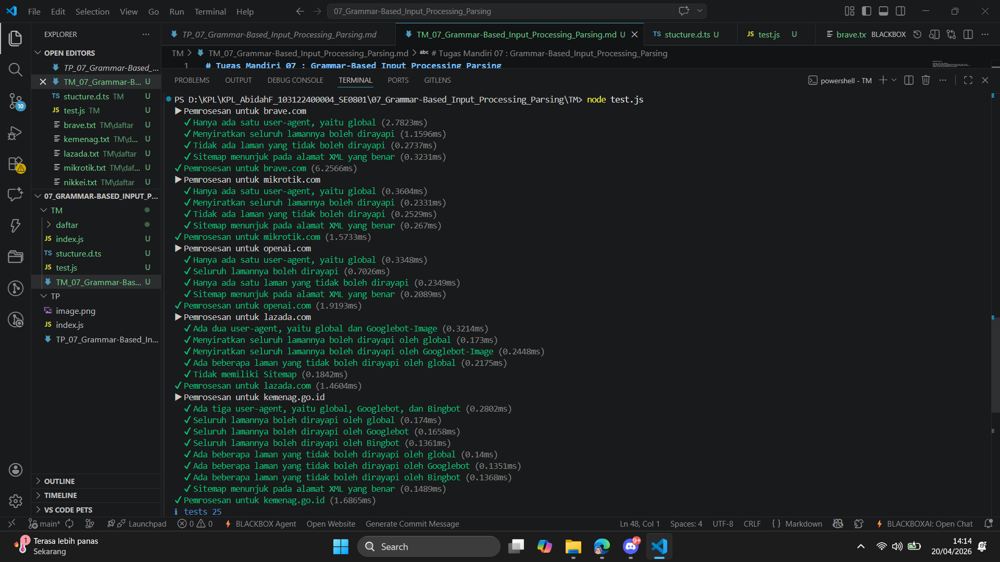

# Tugas Mandiri 07 : Grammar-Based_Input_Processing_Parsing

Nama : Abidah F

Kelas : SE08-01

NIM : 103122400004

**Soal**

Uraikan robot!

Tugas pada kesempatan kali ini adalah membuat fungsi yang menguraikan isi robots.txt menjadi POJO (plain old JavaScript object). Empat properti yang perlu diuraikan dijabarkan di bawah berikut.

User-agent adalah nama robot perayapnya
Allow adalah daftar halaman-halaman yang boleh dirayap
Disallow adalah daftar halaman-halaman yang tidak boleh dirayap
Sitemap adalah sebuah pranala yang menunjuk pada "denah" situs web (biasanya berformat XML)
Kamu akan mengerjakannya di dalam sebuah fungsi bernama parseRobots di index.js dan. Buka direktori 07 di sini untuk mengunduh berkas yang dimaksud, berkas-berikas robots.txt di dalam direktori daftar, dan berkas pengujiannya yaitu test.js.

Jadi, strukturnya harus seperti ini:

|   index.js
|   structure.d.ts // Opsional mau ada atau tidak
|   test.js
\---daftar
        brave.txt
        kemenag.txt
        lazada.txt
        mikrotik.txt
        nikkei.txt
        openai.txt
Agar kode yang kamu tulis di index.js bekerja atau tidak, jalankan test.js. Jika kamu membuat proyek Node (yang ada package.json), pastikan untuk membuat impor menjadi CommonJS dengan type: commonjs.

Beberapa petunjuk:

Manajemen state akan membantu
Nilai tambah jika kamu bisa mendeskripsikannya secara code tracing
Tidak perlu program untuk membaca TXT, itu sudah dilakukan oleh test.js
Hubungi asprak jika ada kendala atau kesalahan

**Kode sumber**

Tersedia di [index.js](./index.js) 

**Output**

**Penjelasan**

sesuai yang diminta soal :3