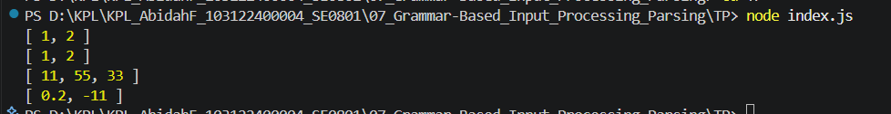

# Tugas Pendahuluan 07 : Grammar-Based_Input_Processing_Parsing

Nama : Abidah F

Kelas : SE08-01

NIM : 103122400004

**Soal**

Buatlah fungsi yang mengubah deretan angka bertipe string menjadi larik angka.

**Kode sumber**

Tersedia di [index.js](./index.js) 

**Output**

**Penjelasan**

membuat fungsi yang mengubah deretan angka bertipe string menjadi larik angka.