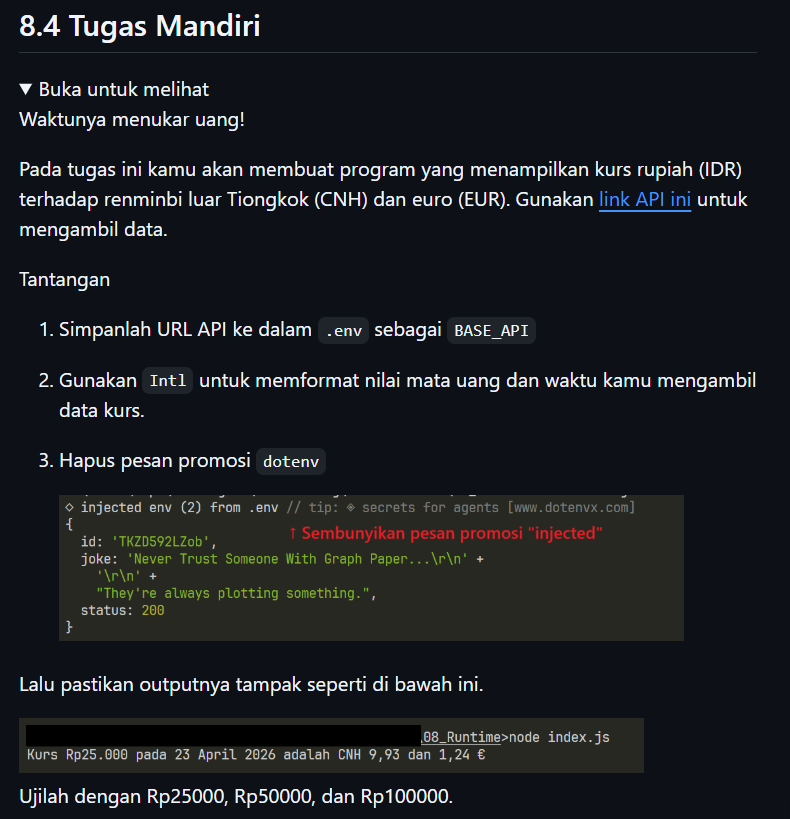
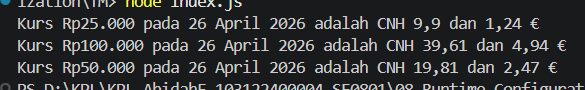

# Tugas Mandiri 08: Grammar-Based_Input_Processing_Parsing

Nama : Abidah F

Kelas : SE08-01

NIM : 103122400004

**Soal**

**Kode sumber**

Tersedia di [index.js](./index.js) 

**Output**

**Penjelasan**

sesuai soal :3

ya itu ada di file main.js buat hpus pesan injectednya, terus kaya kmrn guided itu ubah ubah code di index dan env