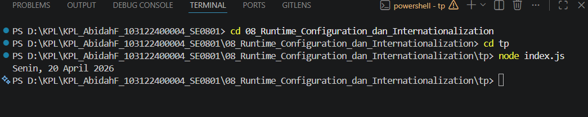

# Tugas Pendahuluan 07 : Grammar-Based_Input_Processing_Parsing

Nama : Abidah F

Kelas : SE08-01

NIM : 103122400004

**Soal**

Tampilkan tanggal sekarang dengan format seperti ini:

Sabtu, 18 April 2026
Nilai waktu tidak harus sama, asalkan formatnya benar dan bisa tampil di komputer terpisah pada waktu tertentu. Gunakan Intl.DateTimeFormat (bukan string manual).

**Kode sumber**

Tersedia di [index.js](./index.js) 

**Output**

**Penjelasan**

sesuai soal :3