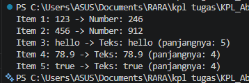

# Tugas Pendahuluan 10

Nama : Abidah F

Kelas : SE08-01

NIM : 103122400004

**Soal**

Cobalah untuk menangkap kecacatan dalam kode ini

**Kode sumber**

Tersedia di [index.js](./index.js) 

**Output**



**Penjelasan**

## Analisis Bug pada Kode Tugas Pendahuluan

Mari kita telusuri kodenya. Fungsi `processData` memanggil `.toLowerCase()` pada parameter `data`, tapi tidak semua elemen array adalah string:

```javascript
const data = [
  "123",   // string ✓
  456,     // number ✗
  "hello", // string ✓
  78.9,    // number ✗
  true,    // boolean ✗
];
```

**Bug utama:** `456`, `78.9`, dan `true` tidak memiliki method `.toLowerCase()` — memanggil method itu langsung pada tipe non-string akan melempar `TypeError`.

---

### Cara Debug-nya

Jalankan kode aslinya, maka akan muncul error:

```
TypeError: data.toLowerCase is not a function
```

Error terjadi saat `i = 1` (nilai `456`).

---

### Perbaikannya

Konversi `data` ke string terlebih dahulu sebelum memanggil `.toLowerCase()`:

```javascript
function processData(data) {
  const str = String(data).toLowerCase(); // ← tambahkan String()
  const num = parseInt(str);
  if (!isNaN(num) && str === String(num)) {
    return `Number: ${num * 2}`;
  }
  return `Teks: ${str} (panjangnya: ${str.length})`;
}
```

### Output setelah diperbaiki:

```
Item 1: 123   -> Number: 246
Item 2: 456   -> Number: 912
Item 3: hello -> Teks: hello (panjangnya: 5)
Item 4: 78.9  -> Teks: 78.9 (panjangnya: 4)
Item 5: true  -> Teks: true (panjangnya: 4)
```

---

### Catatan tambahan

Item 4 (`78.9`) masuk ke cabang `Teks` karena `parseInt("78.9")` menghasilkan `78`, tapi `"78.9" !== "78"`, sehingga kondisi `str === String(num)` gagal — ini perilaku yang logis sesuai logika kode aslinya (hanya bilangan bulat yang dianggap "Number").